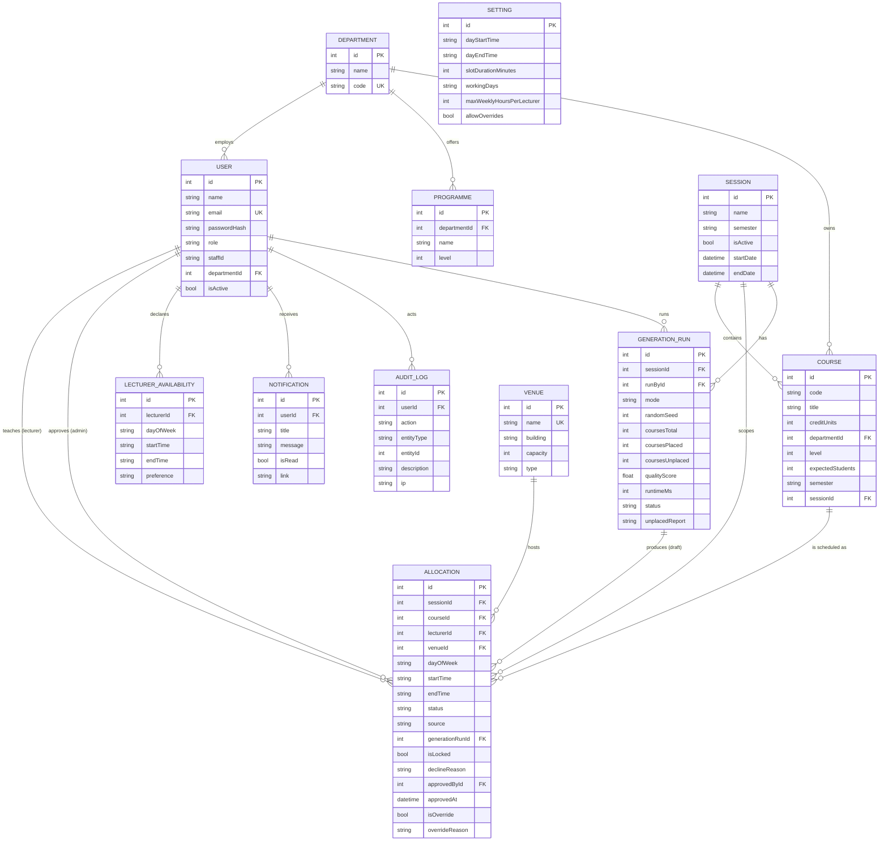

# Course Allocation System — Entity-Relationship Diagram

Database: **PostgreSQL** (Neon, via Prisma). Times are stored as `HH:MM` strings; enum-like
columns are `String` with allowed values enforced by the Zod layer (`lib/validation.ts`).

## Key relationships

- An **Allocation** is the central "timetable row": it ties one *course*, one *lecturer*,
  one *venue* and one *session* to a `dayOfWeek` + `startTime`–`endTime`.
- The **conflict engine** treats allocations with status `approved` or `pending` in the
  active session as "occupying" their slot.
- A **GenerationRun** produces many draft allocations at once; accepting the run promotes
  them to `approved`, discarding/rolling back removes them.

## Use-case list (for the write-up)

**Admin**
1. Manage academic sessions, departments, programmes, venues, courses, lecturers, settings (CRUD).
2. Review pending allocation requests → approve / reject with reason / override with justification.
3. Run the automatic timetable generator (fill or full mode, optional seed).
4. Preview a generated draft, edit slots manually (re-validated), lock slots, accept/discard/roll back.
5. Publish / unpublish a session's timetable.
6. View dashboards, conflict reports and lecturer-workload reports; export to PDF/Excel.
7. View the audit log.

**Lecturer**
8. Register / log in / complete profile / declare availability.
9. Submit an allocation request with live conflict feedback.
10. View own timetable, own weekly workload, request history and decline reasons.
11. Receive in-app notifications on approval / rejection / override.

**Student / Public**
12. Select department + level and view the published timetable (no login), print it.
