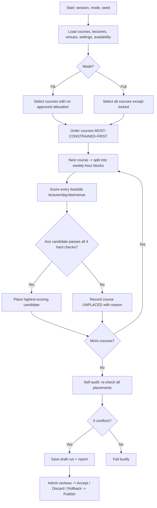

# Methodology — YIBS Course Allocation System

This chapter explains the algorithms and design decisions behind the system, suitable for
direct inclusion in the project report.

## 1. The interval-overlap rule

Every clash reduces to one question: *do two time intervals on the same day overlap?* Times
are stored as `HH:MM` and compared as integer **minutes since midnight** to avoid any
floating-point or timezone error. Two slots `[aStart, aEnd)` and `[bStart, bEnd)` overlap
**iff**:

```
aStart < bEnd  AND  aEnd > bStart
```

Crucially this is a strict comparison, so **touching edges do not clash**: `08:00–10:00` and
`10:00–12:00` are compatible, while `09:00–11:00` and `10:00–12:00` conflict. Testing for
equality of start times (a common student mistake) would miss partial overlaps entirely.

## 2. The four conflict types

For a requested slot the checker examines every allocation that is **approved or pending in
the same active session**, on the same day, that overlaps in time, and reports:

1. **Class / student-group conflict** — same *department + level* (the students would have to
   be in two places at once). This is the primary scenario.
2. **Lecturer conflict** — the same lecturer is already teaching.
3. **Venue conflict (department-scoped)** — the same hall/lab is already occupied by a class
   in the **same department**. Different departments may run at the same time, so only a
   within-department venue overlap blocks; the system lists the **free venues** otherwise.
4. **Policy violations** — outside the teaching-day window or a non-working day, `end ≤ start`,
   a duration that is not a multiple of the slot length, a duplicate of the same course, plus
   **soft** warnings (venue too small, lecturer over the weekly-hours cap) that an admin may
   still approve.

When a request is blocked the engine also returns the **nearest five free slots** that clear
all four checks, so the user can fix the clash in one click. The identical function
(`checkConflicts`) runs on the live AJAX form, on final submit (inside a database
transaction to defeat race conditions), and inside the generator — so the rules can never
diverge.

## 3. Most-constrained-first ordering (why it matters)

The generator places the **hardest-to-schedule courses first**, because a course with few
feasible slots left is far more likely to become unplaceable if the easy courses have already
consumed the good slots. Courses are ordered by:

1. **largest weekly hours** (occupy the most time),
2. then **largest expected students** (need the few big venues),
3. then **fewest suitable venues** (least flexibility).

This "fail-first" heuristic is standard in constraint satisfaction and dramatically reduces
the number of courses left unplaced compared with an arbitrary order.

## 4. Greedy placement with bounded backtracking

For each course block the generator scores **every feasible (lecturer, day, slot, venue)**
combination and takes the highest-scoring one that passes all four hard checks. If a course
cannot be placed it is recorded as **unplaced with a specific reason** (e.g. *"no venue with
capacity ≥ 250"*) rather than being dropped silently or placed illegally. After a run the
engine performs a **self-audit** — re-checking every generated allocation against the others —
and reports *"0 conflicts detected"* (or fails loudly). An optional **random seed** makes runs
**repeatable**: the same inputs always produce the same timetable, which is essential for a
reliable live demo.

## 5. Soft-constraint scoring

Among the conflict-free candidates, quality is a weighted score (higher is better):

- spread a course's weekly hours across **different days** (penalise same-day blocks),
- prefer the venue whose capacity is **closest to but not below** the class size,
- honour lecturer **preferred** windows and never use **unavailable** ones,
- keep the **lunch break** clear,
- give **large classes morning** slots.

The final quality score (0–100) summarises how well the soft constraints were satisfied.

## 6. Why timetabling is NP-hard — and why a heuristic is appropriate

University timetabling is a generalisation of **graph colouring** (assign "colours" = time
slots to "vertices" = classes so that adjacent vertices — those sharing students, a lecturer
or a venue — never share a colour), which is **NP-complete**. No algorithm is known that
solves every instance optimally in polynomial time, and the search space is astronomically
large (each of *C* courses × *D* days × *S* slots × *V* venues). A **greedy heuristic with a
good ordering** therefore trades guaranteed optimality for speed and predictability: it finds
a **valid, high-quality** timetable in seconds and transparently reports anything it could not
place, which is exactly what a real registrar needs.

## 7. Time complexity

- **Conflict checker** — for one request it scans the *E* occupying allocations of the session
  once: **O(E)**. Free-slot suggestion scans the *D × S* candidate pool against those
  allocations: **O(D · S · E)**.
- **Generator** — for each of *C* courses it evaluates up to *L × D × S × V* candidates, each
  costing an **O(E)** conflict check, giving a worst case of **O(C · L · D · S · V · E)**.
  In practice pruning (capacity filters, availability, early rejection) makes it far faster —
  the 40-course demo generates in a few seconds and meets the 200-course / 10-second target.

## 8. Generation flowchart


